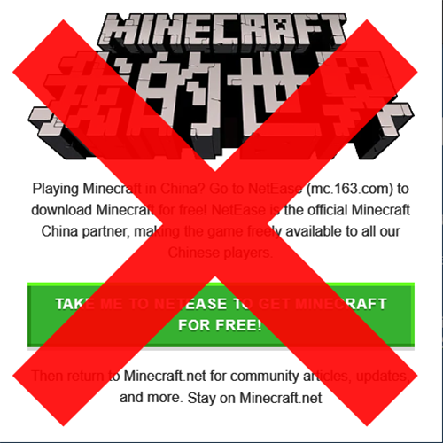

# I Dont Want Minecraft China Edition
[Chinese Simplified Doc / 简中文档](./README-zh.md)

A liteweight userscript for Chinese Minecraft players to remove Minecraft China Edition popup from [Minecraft Official Website](https://minecraft.net)

  
  
## How to use
### Step 1: Install Tampermonkey or Greasemonkey

> [!TIP]
>
> If you installed one of them, you can skip this step
>

[Install Tampermonkey](https://www.tampermonkey.net/) [RECOMMAND]

[Install Greasemonkey for Firefox](https://addons.mozilla.org/en-US/firefox/addon/greasemonkey/)

  
  
### Step 2: Install IDWMCCE
[Click here to install IDWMCCE](https://fastly.jsdelivr.net/gh/XiaozhiSans/idwmcce@latest/idwmcce.user.js)

  
  
### Step FINAL: Check if it work
Visit [Minecraft Official Website](https://minecraft.net)

If it work, you will not see the Minecraft China Edition popup

Don't forget star if it can help you! awa

  
  
## About
[Feedback](https://github.com/XiaozhiSans/idwmcce/issues)

IDWMCCE by [XiaozhiSans](https://github.com/XiaozhiSans)

Licensed under [MIT license](./LICENSE)
